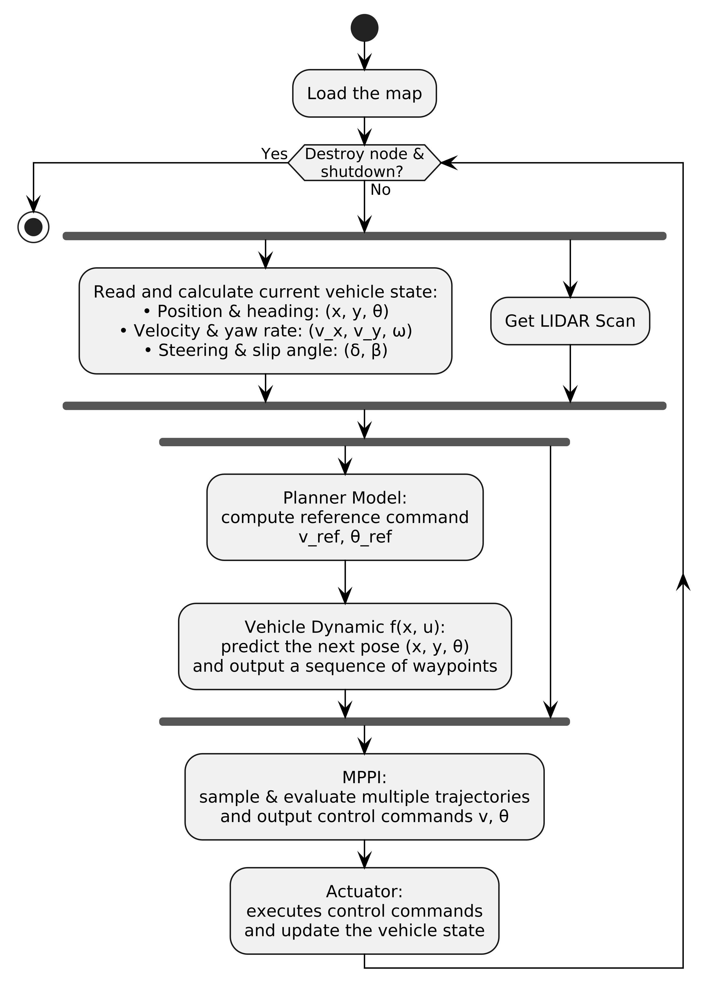

# Learning-Guided Control
This project implements a hierarchical control framework for autonomous racing, combining reinforcement learning (RL) and model predictive path integral (MPPI) control.

## Description
The full pipeline is as shown below:  

- **RL policy**: Generates high-performance reference trajectories using onboard sensor and odometry data.
- **MPPI controller**: Tracks the RL-generated trajectories in real-time for safe and robust execution.

This hybrid approach addresses sim-to-real gaps and safety issues, enabling reliable deployment on hardware.

## Demo
### Simulation:
<table>
  <tr>
    <td></td>
    <td></td>
  </tr>
</table>

### Hardware Run:
[](https://youtu.be/qhtq4Dn11mY)

## Hardware & Software

- Tested on **NVIDIA Jetson Orin Nano**
- Sensor: **Hokuyo LiDAR**
- OS: **Ubuntu 22.04**  
- ROS: **ROS 2 Humble**


## Environment Setup
**For RL Training**
```
virtualenv gym_env
source gym_env/bin/activate
cd gym
pip install -e .
pip install stable-baselines3 sb3_contrib wandb numba scipy \
   yamldataclassconfig opencv-python meta visdom tensorboard
export PYTHONPATH=$PYTHONPATH:./f1tenth_gym
```

**For RL Inference and MPPI**
Make sure to follow [jax_for_jetson](https://github.com/zzangupenn/jax_for_jetson) for installing compatible Python and JAX versions.

Then:

```bash
# Python 3.10 and numpy 1.26.4 are required
pip install jax==0.4.26
pip install onnxruntime-gpu  # You dont need to install onnxruntime (CPU version)
```

## RL Training and Export
### Train
Run the following command to train the RL policy:
```bash
python learn.py --config /path/to/cfg.yml
```

### Evaluate
To evaluate a trained policy:
```bash
python eval.py --config /exp/from/training.yml --model /saved/sb3/model.zip
```
⚠️ Make sure that render_mode is set to human in your config to enable visualization.

### Export to ONNX
After training, export the model to ONNX format:
```bash
python export.py --model /saved/sb3/model.zip --out_path /out/location/path.onnx
```

## RL Inference and MPPI
### Simulation Setup
In your `config_example.yaml`, set:
```yaml
is_sim: true
```
Use **three terminals** to run the system:
**Terminal 1** – Launch gym:
```bash
ros2 launch f1tenth_gym_ros gym_bridge_launch.py
```

**Terminal 3** – Run RL node:
```bash
ros2 run mppi_control rl_node.py
```

**Terminal 3** – Run MPPI controller:
```bash
ros2 run mppi_control mppi_node.py
```


### Hardware Setup
In your `config_example.yaml`, set:
```yaml
is_sim: false
```

Use **four terminals** to run the system:

**Terminal 1** – Launch car bringup:  
```bash
ros2 launch f1tenth_stack bringup_launch.py
```

**Terminal 2** – Run localization (particle filter):
```bash
ros2 launch particle_filter localize_launch.py
```

**Terminal 3** – Run RL node:
```bash
ros2 run mppi_control rl_node.py
```


**Terminal 4** – Run MPPI controller:
```bash
export JAX_PLATFORM_NAME=cpu
ros2 run mppi_control mppi_node.py
```
In this setup, both the particle filter and RL policy run on the GPU, while MPPI runs on the CPU. This configuration has proven to be the most effective for overall system performance based on our testing.